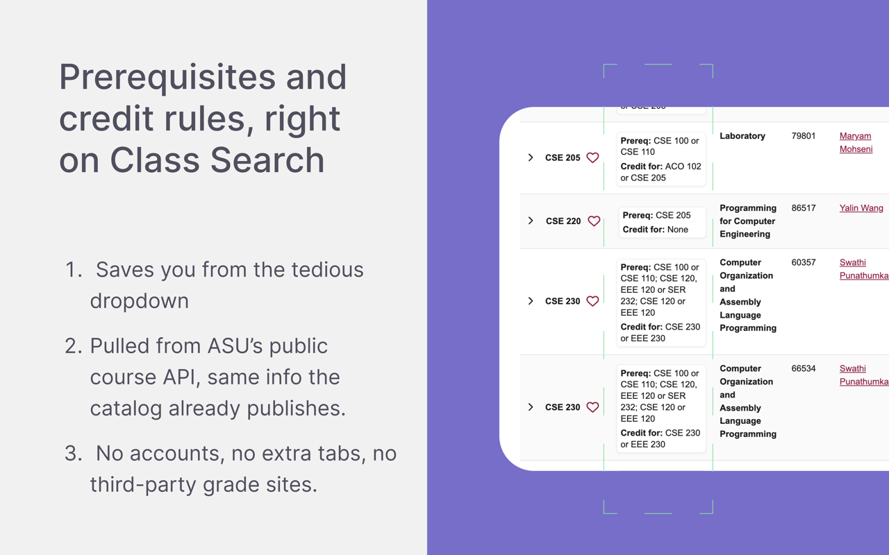
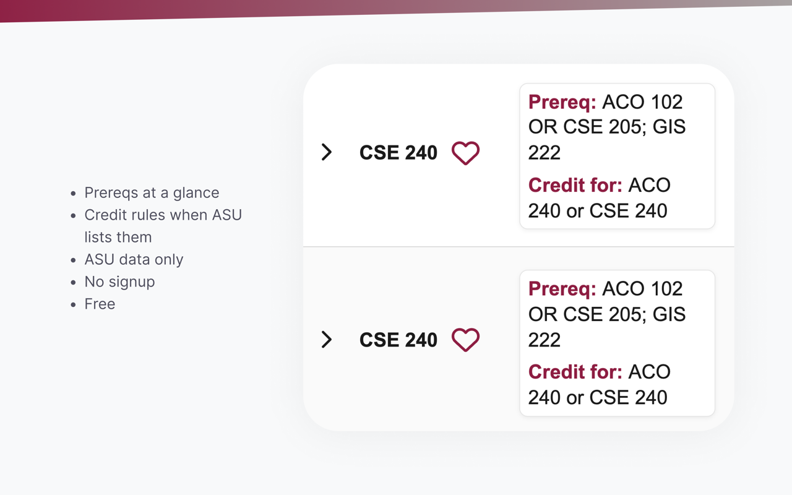

# ASU Prereq Helper

> See prerequisites and duplicate-credit rules right in ASU Class Search. No more hunting through course catalog pages.

---

---

## What it does

When you search for classes on [ASU Class Search](https://catalog.apps.asu.edu/), each course row gets a small inline card showing:

- **Prereq:** the enrollment requirements for that course
- **Credit for:** any duplicate-credit restrictions

All data comes directly from ASU's own public course API. No third-party sites, no scrapers, no data collection.

---

## Features

| Feature | Details |
|---|---|
| Prerequisites at a glance | Prereq text appears beside the course code, inline |
| Duplicate credit warnings | Shows "credit allowed for ..." when the catalog includes it |
| Official data only | ASU's public course API over HTTPS |
| Term aware | Detects the session from the URL; remembers your last session |
| Manual override | Set a four-digit term code in Options if auto-detect misses |
| Minimal permissions | `storage` + `*.asu.edu` only |

---

## Usage

1. Go to [ASU Class Search](https://catalog.apps.asu.edu/)
2. Search or browse as usual
3. Prereq and credit info appears automatically next to each course row

**If prereq cards are not showing**, the extension may not have detected a term code:

1. Right-click the extension icon and open **Options**
2. Look at the URL bar on Class Search and find the `term=XXXX` value (four digits)
3. Enter those four digits and save
4. Refresh Class Search

---

## Options

Right-click the extension icon and open **Options**

- **Session code:** manually set the four-digit term code (`term=` in the address bar)
- Leave it blank to rely on automatic detection

The code syncs via Chrome sync if you are signed in to Chrome.

---

## Privacy

- No personal data collected, no analytics, no ads
- No selling or sharing data with third parties
- All course data is fetched directly from ASU's systems
- Only the current/last session code and your optional override are stored locally

Full policy: [privacy.html](https://robcaran.github.io/asu-prereq-extension/privacy.html) · [PRIVACY.md](PRIVACY.md)

---

## Contributing

Bug reports and pull requests are welcome via [GitHub Issues](https://github.com/robcaran/asu-prereq-extension/issues).

---

## License

MIT -- see [LICENSE](LICENSE).

---

Made for ASU students who are tired of clicking into every course just to check prerequisites. If it saves you time, give the repo a star.
